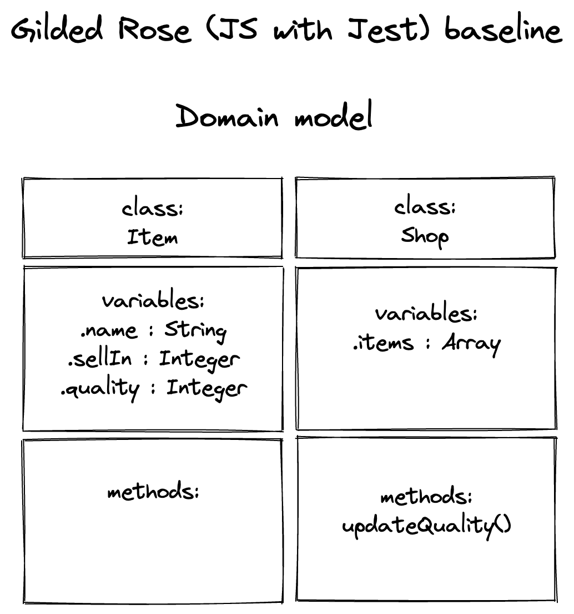

# Gilded Rose

This is my solution to the Gilded Rose kata in JavaScript with Jest. Used to practise doing a tech test during week 10 of Makers Academy, focusing on code quality.

This kata was originally created by Terry Hughes (http://twitter.com/TerryHughes) and is on GitHub [here](https://github.com/NotMyself/GildedRose). See also [Bobby Johnson's description of the kata](http://iamnotmyself.com/2011/02/14/refactor-this-the-gilded-rose-kata/). The original kata as for C# and seed codebase for JS and Jest comes from [Emily Bache's library of seeds in different languages](https://github.com/emilybache/GildedRose-Refactoring-Kata).

## Client requirements

### Instruction from the kata

"Hi and welcome to team Gilded Rose. As you know, we are a small inn with a prime location in a prominent city run by a friendly innkeeper named Allison. We also buy and sell only the finest goods. Unfortunately, our goods are constantly degrading in quality as they approach their sell by date. We have a system in place that updates our inventory for us. It was developed by a no-nonsense type named Leeroy, who has moved on to new adventures. Your task is to add the new feature to our system so that we can begin selling a new category of items. First an introduction to our system:

All items have a SellIn value which denotes the number of days we have to sell the item. All items have a Quality value which denotes how valuable the item is. At the end of each day our system lowers both values for every item. Pretty simple, right? Well this is where it gets interesting:

    Once the sell by date has passed, Quality degrades twice as fast
    The Quality of an item is never negative
    “Aged Brie” actually increases in Quality the older it gets
    The Quality of an item is never more than 50
    “Sulfuras”, being a legendary item, never has to be sold or decreases in Quality
    “Backstage passes”, like aged brie, increases in Quality as it’s SellIn value approaches; Quality increases by 2 when there are 10 days or less and by 3 when there are 5 days or less but Quality drops to 0 after the concert

We have recently signed a supplier of conjured items. This requires an update to our system:

    “Conjured” items degrade in Quality twice as fast as normal items

Feel free to make any changes to the UpdateQuality method and add any new code as long as everything still works correctly. However, do not alter the Item class or Items property as those belong to the goblin in the corner who will insta-rage and one-shot you as he doesn’t believe in shared code ownership (you can make the UpdateQuality method and Items property static if you like, we’ll cover for you)."

## Test coverage

## Solution design approach

### Current domain model

I start with a quick domain model diagram of the current state of the production code, as follows:



### Analysis of each item

I then analyse the behaviour of each of the current categories of items. I analys the production code and add comments to it, and I sense-check against the client description above. I use this to generate behavioural profiles for each category. See below:

#### Standard item

- Starts with a `quality` score: e.g. `20`
- Starts with a `sellIn` number of days: e.g. `10`
- min `quality` of `0`
- Every day, `sellIn` days goes down by `1` and `quality` score goes down by `1`, except
- When past their sell-by dates (i.e. when their `sellIn` days is zero or less), `quality` score goes down by `2` unless
- When past their sell-by dates (i.e. when their `sellIn` days is zero or less) and `quality` is `1`, `quality` goes down by `1` as it hits thew minimum  and
- When past their sell-by dates (i.e. when their `sellIn` days is zero or less) and `quality` is `0`, `quality` doesn't change as already hit minimum


#### Aged Brie

- Starts with a `quality` score: e.g. `20`
- Starts with a `sellIn` number of days: e.g. `10`
- Every day, `sellIn` days goes down by `1` and `quality` score goes **up** by `1`, except...
- When past its sell-by date (i.e. when their `sellIn` days is zero or less), `quality` goes goes up every day by `2`
- max `quality` of `50`

#### Backstage passes

- Starts with a `quality` score: e.g. `20`
- Starts with a `sellIn` number of days: e.g. `10`
- Every day, `sellIn` days goes down by `1` and `quality` score goes **up** by `1`, except...
- When within 10 days of sell-by date (i.e. when their `sellIn` days are less than `11`), `quality` goes **up** by `2`, except...
- When within 5 days of sell-by date (i.e. when their `sellIn` days are less than `6`), `quality` goes **up** by `3`, except...
- When past their sell-by dates (i.e. when their `sellIn` days are negative), `quality` goes to `0`
- max `quality` of `50`

#### Sulfuras
- Starts with a `quality` score: e.g. `20`
- Starts with a `sellIn` number of days: e.g. `10`
- `sellIn` days doesn't change day-by-day
- `quality` score doesn't change day-by-day


### Write passing tests

I now write a suite of tests to reflect the behaviour of the categories of items above. I structure the test suite as follows:
- I describe Gilded Rose
    - within which I describe Shop class
        - within which I describe .updateQuality method
            - within which I describe with of the categories of items in turn
                - testing for each of the behaviours set out in my analysis above.

### Refactor


## Code structure

### Dependencies

## Usage

### Getting started (installing the code)

### Usage (executing the program)

### Running tests

### Potential future extensions

## Getting started

Install dependencies

```sh
npm install
```

## Running tests

To run all tests

```sh
npm test
```

To run all tests in watch mode

```sh
npm run test:watch
```

To generate test coverage report

```sh
npm run test:coverage
```
